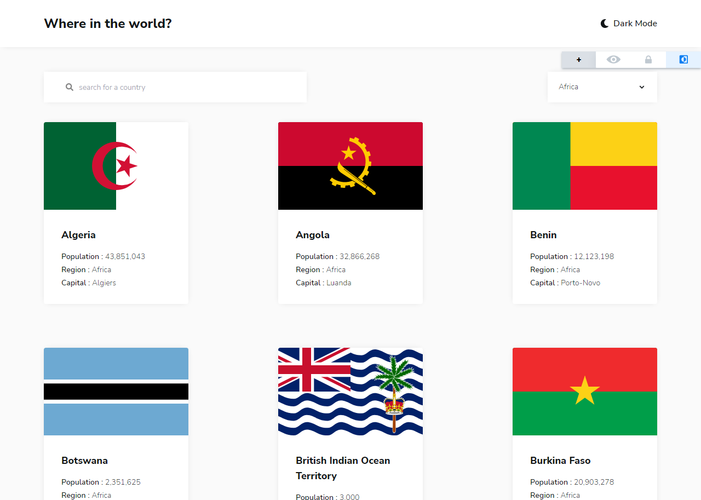

# Frontend Mentor - REST Countries API with color theme switcher solution

### Screenshot

## Table of contents

-  [Overview](#overview)
   -  [The challenge](#the-challenge)
   -  [Screenshot](#screenshot)
   -  [Links](#links)
-  [My process](#my-process)
   -  [Built with](#built-with)
   -  [What I learned](#what-i-learned)
   -  [Continued development](#continued-development)
   -  [Useful resources](#useful-resources)
-  [Author](#author)
-  [Acknowledgments](#acknowledgments)

## Overview

### The challenge

Users should be able to:

-  See all countries from the API on the homepage
-  Search for a country using an `input` field
-  Filter countries by region
-  Click on a country to see more detailed information on a separate page
-  Click through to the border countries on the detail page
-  Toggle the color scheme between light and dark mode

### Links

-  Solution URL: [Add solution URL here](https://your-solution-url.com)
-  Live Site URL: [Add live site URL here](https://your-live-site-url.com)

## My process

### Built with

-  Semantic HTML5 markup
-  JSX
-  CSS custom properties
-  Flexbox
-  CSS Grid
-  Mobile-first workflow
-  [React](https://reactjs.org/) - JS library
-  [TailwindCSS](hthttps://tailwindcss.com/) - CSS framework
-  [Redux](https://redux.js.org/) - JS state management.

### What I learned

This project helped to learn about tailwind css. Tailwindcss is basically a utility-first CSS framework for rapidly building custom user interfaces. I didn't need to create a new css file simply add a className to style a components.

Also this project helped me to understand a redux, although the state management of this project is not great it helped me to understand the redux.

This project helped me to understand more about localstorage with reactJS

### Continued development

Need to continued develop the state management of the projects and need to memorize some css className of tailwind frameworks.

### Useful resources

-  [TailwindCSS](https://tailwindcss.com/) - This documentation helped to understand about CSS frameworks. I really liked this pattern and will use it going forward.

## Author

-  Website - [Add your name here](https://www.benjoquilario.me/)
-  Frontend Mentor - [@yourusername](https://www.frontendmentor.io/profile/benjoquilario)
-  Twitter - [@yourusername](https://twitter.com/iam_benjo)
